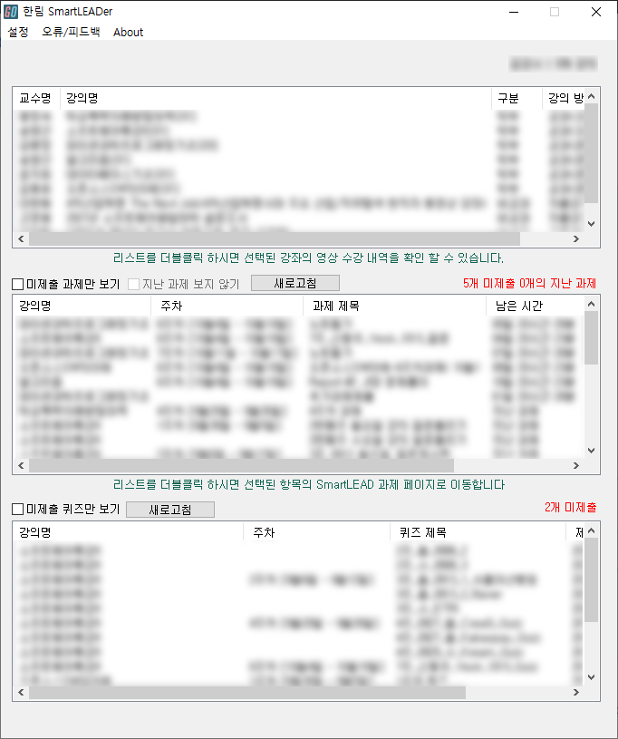

# SmartLEADer
> Windows용 SmartLEAD 확장 프로그램  

  
Autohotkey로 제작된 Windows용 SmartLEAD 확장 프로그램 입니다.  
현재 라이센스 확인 및 배포 준비중에 있습니다.

  

 

# 프로그램 다운로드
> ## Windows  
> * 프로그램 다운로드  

 

# 업데이트 내역
* Valpha.0.1 (2021.10.09)
   * Github에 프로그램 Repo 생성
   * Alpha Test를 위한 배포용 프로그램  

 

# 정보
> ## 개발자
> * Gangsu Kim
> * e-mail : gangsu1813@naver.com

> ## 개발언어
> 

> ## License
> * 라이선스 확인 중 
